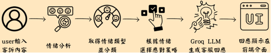

# AI-Customer-Complaint-Training
生程式AI期末專案-AI客訴應對回應訓練系統

# 展示影片

[ ]

## 📌 專案介紹
使用 Groq + LLM 模型 作為回應生成核心，針對輸入的客訴文本分析情緒與重點，並產生適切回覆，
並透過 UI 介面(Gradio)輸入實際案例，展示多版本回覆建議供客服挑選與學習。

## 🎯 研究目的
1.建立一個讓使用者練習「客訴應對」的訓練系統
2.使用者輸入抱怨句，系統即時提供合適回應
3.協助學習者強化應對技巧，提升顧客溝通能力
4.應用於客服新人訓練、自我學習與職場溝通輔導

## 🧩 方法架構

## 🔧 使用模型
京東商品評論情緒分類: 使用了 5 個中文文字分類數據集。
JD full、JD binary、大眾點評數據集由不同情感極性的使用者評論組成。
鳳凰網和中國新聞網由不同主題類別的新聞文章的第一段組成。
它們由 GlyphLinks to an external site. 專案收集......

